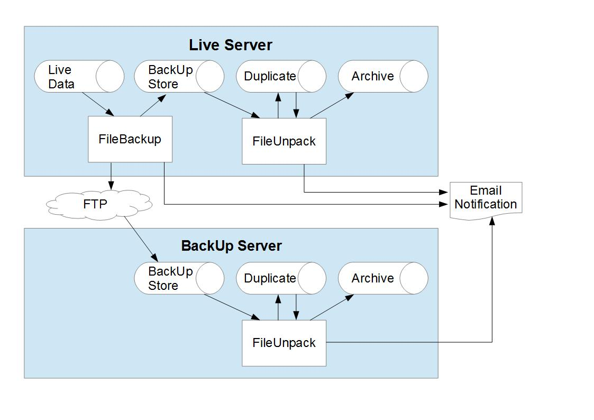

# FileBackup
Powershell scripts designed to provide incremental backup of directory structures (Groups) of files.


[![Contributors][contributors-shield]][contributors-url]
[![Forks][forks-shield]][forks-url]
[![Stargazers][stars-shield]][stars-url]
[![Issues][issues-shield]][issues-url]
[![MIT License][license-shield]][license-url]
[![LinkedIn][linkedin-shield]][linkedin-url]


<!-- PROJECT LOGO -->
<br />
<p align="center">
  <a href="https://github.com/GrumpyGel/FileBackup">
    
  </a>

  <p align="center">
    <a href="https://github.com/GrumpyGel/mdzWebRequest_Test/issues">Report Bug</a>
    ·
    <a href="https://github.com/GrumpyGel/mdzWebRequest_Test/issues">Request Feature</a>
  </p>
</p>


<!-- TABLE OF CONTENTS -->
<details open="open">
  <summary><h2 style="display: inline-block">Table of Contents</h2></summary>
  <ol>
    <li><a href="#about-the-project">About The Project</a></li>
    <li><a href="#installation--usage">Installation &amp; Usage</a></li>
    <li><a href="#documentation">Documentation</a></li>
    <ol>
      <li><a href="#terms">Terms</a></li>
      <li><a href="#backup">Backup</a></li>
      <li><a href="#unpack">Unpack</a></li>
      <li><a href="#tutorial">Tutorial</a></li>
    </ol>
    <li><a href="#license">License</a></li>
    <li><a href="#contact">Contact</a></li>
    <li><a href="#acknowledgements">Acknowledgements</a></li>
  </ol>
</details>


<!-- ABOUT THE PROJECT -->
## About The Project

The FileBackup routines are Powershell scripts designed to provide incremental backup of directory structures (Groups) of files.

Backup files are created as Compressed (Zipped) folders containing any changed files, a directory Log at the time the backup was taken and a Difference file listing newly created or deleted Directories and newly created, modified or deleted Files.

The backups are created on the same server (unless using mapped drives) but also have an Ftp option to transfer the backups to a remote server.

The directory Log from the most recent Backup is used to determine changes needed to be included in the current Backup. A Log must be manually created to initiate the then incremental BackUp.

The routines also include an Unpack facility that takes Backup files and extracts changes to a duplicate Group directory structure. This provides a complete ready-to-use directory structure ideally on another hard drive/server using mapped drives or Ftp.


<!-- GETTING STARTED -->

## Installation & Usage

Clone the repo
   ```sh
   git clone https://github.com/GrumpyGel/FileBackup.git
   ```


<!-- DOCUMENTATION -->
## Documentation

### Terms

Terms used in this documentation are as follows:

| Term | Description |
| --- | --- |
| Group | The Group of files to be BackedUp. The Group has a Path (directory) that contain the files. |
| Duplicate | A directory FileBackup (Unpack) will replicate the Group's content into. |
| Log file | A Log file containing directory listing of a Group. |
| Differences file | A Differences file listing changes to directories and files between 2 (previous and current) Log files. |
| BackUp | The BackUp file, compressed (zip) archive containing new or modified files plus Log and Differences file for this Backup. BackUp also refers to the process of creating a BackUp. |
| Unpack | The process of taking a BackUp file and extracting its content into the Duplicate. |
| Verify | The process of comparing the Duplicate content against a BackUp Log file. |
| Store | A directory used by FileBackup to Store Backup files. The BackUp files contain the Group and timestamp in the filename and can accumulate in the Store for all Groups. |
| Archive | A directory Unpack will create where deleted directories and deleted or update files from the Duplicate are moved to when Unpacking. This enables a roll back should it be required. |
| ArchiveStore | A directory where Unpack will create Archives. Each Group should have its own ArchiveStore. |

### Backup

The Backup component of the FileBackup routines contains the following scripts..

| Script | Description |
| --- | --- |
| FileLog.ps1 | This reads a directory structure and produces a Log file of all directories and files. The log contains the size and last modified date for files. |
| FileLogCompare.ps1 | This reads 2 Log files and produces a Differences file. |
| FileBackup.ps1 | This can be run manually or on a task scheduler to BackUp a Group. It can optionally upload the Backup to an Ftp server. |
| FileBackupBatch.ps1 | Using a configuration file, this can be run manually or on a task scheduler to BackUp multiple Groups. |

#### FileLog.ps1

The FileLog script captures the Group's directory content producing a Log file of all directories and files. The log contains the size and last modified date for files. FileLog is mainly used from within other scripts, however, it must also be run manually when setting up a Group to be backed up - see "Tutorial" for more information. Parameters:

| Parameter | Description |
| --- | --- |
| -Path | The Group directory to Log. Example "E:\\MyDocz\\FileBackup\\TestGroup\\Live" |
| -LogFile | Name of the Log file to create. If not supplied output is displayed to console. Example "Backup_TestGroup_Initial.log" |
| -Ignore | List of directories to ignore in the backup. The directories should be relative to -Path. directories should be separated by ';'. Example "Temp;Work\\Old;Work\\Temp" |

Ouput is a text file with each line representing a directory or file. Similar to CSV file, the data components are separated by '\*' (as this can not appear in a file name). The first field (always a single character field) shows what type of line it is, as follows:

| Type | Description |
| --- | --- |
| I\* | If included, this will be the first line in the file. The 2nd (and only other) field on the line will contain the Ignore parameter value used when creating the Log. Example "I*Temp;Work\Old;Work\Temp". |
| D\* | Represents a Directory. The 2nd (and only other) field on the line will contain the Directory name. The name is relative to the Group directory. The Group Directory is included, with a blank name, and will be the first line in the file or 2nd if an Ignore record is present. Example "D\*Images". |
| F\* | Represents a File. There are 3 following fields being the Name, Size and Last Write Time. Example "F\*Logo.jpg\*54321\*20210306115426". |

The Directory is listed first, all files in the directory are then listed. Subdirectories are then recursed. Directories and Files within them are listed in alphabetic order.

Main functionality of FileLog is via recursive calls to the CreateLog_Directory function. This add the directory name and all its files to the log, then calls CreateLog_Directory again for all its subdirectories. Log content is buffered into a string and then output once all files are added. This is to improve performance as the cmdlet is used to create the Log file rather than a stream.

#### FileLogCompare.ps1

The FileLogCompare script reads 2 Log files and produces a Differences file. FileLogCompare is used from within the FileBackup script and need not be run manually. Parameters:

| Parameter | Description |
| --- | --- |
| -OldLog | The name of the older/previous Log file. This is the name of the Log file created during the last Backup, or the initial manually created Log for the first time a Backup is created. Example "E:\\MyDocz\\FileBackup\\Store\\Backup_TestGroup_Initial.log". |
| -OldBackup | If the old Log file is contained within a Backup zip file, the OldBaxckup parameter should be used instead of OldLog and should contain the name of the previous Backup file. FileLogCompare will read the old Log file from within the Zip. Example "E:\\MyDocz\\FileBackup\\Store\\Backup_TestGroup_20210306.zip". |
| -NewLog | The name of the newer/current Log file created during this Backup. Example "E:\\MyDocz\\FileBackup\\Store\\Backup_TestGroup_20210306.log". |
| -LogFile | Name of the Difference file to create. If not supplied output is displayed to console. Example "Backup_TestGroup_20210306.dif" |

A file is deemed modified if the size if different or the modified timestamp is more than 3 seconds different. An exact match in timestamps is not required as moving files can truncate the milliseconds of the timestamp which results in seconds being rounded differently.

FileLogCompare does not detect renamed or moved files or directories. If items are renamed or moved, their old name/location will be listed as deleted and current location as new.

Ouput is a text file with each line representing a new or deleted directory or a new, modified or deleted file. Similar to CSV file, the data components are separated by '\*' (as this can not appear in a file name). The fields are change type, object type and name. Change type can be "N"ew, "M"odified (files only) or "D"eleted. The object type can be "D"irectory or "File". The name is the directory or file name relative to the Group path. Examples:

| Example | Meaning |
| --- | --- |
| N\*D\*Images\\Template | New directory named "Images\\Template". |
| D\*D\*Survey | Directory Survey has been deleted. |
| N\*F\*Images\\Template\\Logo.jpg | New file created called Logo.jpg in the Images\\Template directory. |
| M\*F\*Data\\Settings.xml | The file called Settings.xml in the Data directory has been modified. |
| D\*F\*APP_CODE\\clsQuery.cs | The file called clsQuery.cs in the APP_CODE directory has been deleted. |

As FileLogCompare is written to support pre class enabled Powershell. The Old and New Logs are represented internally by Hashtables converted to Objects. Functionality is performed by various Log_* functions that operate on these arrays. They are:

| Function | Description |
| --- | --- |
| Log_Open | Opens the Log as a .Net StreamReader and reads the first line. |
| Log_Clear | Removed record of input Log directory and file. |
| Log_Read | Reads the next line from a Log and populates the array with details of the director or file. |
| Log_Close | Closes a Log. |
| Log_Output | Adds a Difference to the buffered output. |
| Log_ShowOutput | Outputs any buffered content. |
| Log_Compare | Main routine to compare Logs. It is repetetively called from the main script code until both New and Old Logs have been completely read and closed. Once comparisons are made the function will skip necessary lines in the Logs, for example if a folder is deleted that folder (from the Old Log) is recorded as a difference and all files within it skipped. |

#### FileBackup.ps1

FileBackup is a script that uses FileLog and FileLogCompare to package altered files and directories into a compressed zip Backup. Optionaly, the created Backup can be uploaded to an Ftp server. Parameters:

| Parameter | Description |
| --- | --- |
| -Store | Path to the directory used as the Store for Backups. Example "E:\\MyDocz\\FileBackup\\Store". |
| -Name | The name of the Group to be backed up. The only real importance of the name is for use in Backup filenames so that it is identified what the Backup relates to. For example a name of "TestGroup" creates Backup files named "Backup_TestGroup_{timestamp}.zip", Log files named "Backup_TestGroup_{timestamp}.log" and Difference files named "Backup_TestGroup_{timestamp}.dif". |
| -Path | The directory containing the Group's files. Example "E:\\MyDocz\\FileBackup\\TestGroup\\Live". |
| -FtpHost | The host name (or IP Address) of the server to upload the Backup file. This is optional, if no FtpHost is specified, the Backup will not be uploaded to an Ftp server. |
| -FtpUser | If uploading the file, this parameter must be supplied with the login user name. |
| -FtpPassword | If uploading the file, this parameter must be supplied with the login password. |
| -FtpPath | If uploading the file, this parameter may be supplied as the path on the server to upload the Backup to. If not supplied the Backup will be uploaded into the Ftp server's root directory. |
| -Ignore | List of directories to ignore in the Backup. The directories should be relative to -Path. Directories should be separated by ';'. Example "Temp;Work\\Old;Work\\Temp" |
 
The first function of FileBackup is to identify the Log file conmtained within the most recent BackUp. If no previous BackUps are found, FileBackup will use and compare against a Log file named "Backup_{Group}_Initial.log in the Store directory. This Log must be created manually, using the FileLog script, before the first BackUp is performed.

It then calls FileLog to create a Log for this Backup. It then calls FileLogCompare to create a Difference file between the most recent and current Log files.

It then creates the compressed zip Backup file and adds the current Log and Difference files into it. It then reads through the Differences file and the New or Modified files are added to the Backup.

Up until the Backup file has been completed, the Log, Differences and Backup files are created under temporary names. This is performed so that if the process fails, they will not be picked up by subsequent backups which would result in its changes being lost. Only once the Backup has been successfully created is it renamed to its correct name. If the process fails for any reason, the script will try and remove all the temporary named files. Only once the Backup has been successfully created, and uploaded to the FTP server (if specified) will the Backup file name named appropriately. The new Log and Differences files are not retained as individual files, they are only retained within the Backup file.

If the previous Log file used was the Initial file, once the BackUp is complete, this file is renamed to Backup_{Group}_Original.log. This is to ensure it is not inadvertantly picked up subsequently on failed runs.

If the FtpHost is specified, the Backup will then be uploaded to this server.

FileBackup will make 1 of the following console output messages:

```
FileBackup: {Group} No changes to files
FileBackup: {Group} Backup complete {BackUpFilename}
FileBackup: {Group} Backup complete and uploaded {BackUpFilename}
```

#### FileBackupBatch.ps1

FileBackupBatch is a script that takes input from a configuration file to repeatedly call FileBackup to BackUp multiple Groups. Parameters:

| Parameter | Description |
| --- | --- |
| -Config | Name of the Config file to use. This is optional and if not specified, the file "FileBackupBatch.cfg" in the directory the scripts are installed will be used. Example "E:\\MyDocz\\FileBackup\\Bin\\FileBackupBatch.cfg". |
 
The Config file is a text file in the format of an '.ini' file. Each line should have an Item and Value pair separated by "=". Possible Items are as follows:

| Item | Description |
| --- | --- |
| Store | Path to the directory used as the Store for Backups. This is passed as the Store parameter to FileBackUp. If different BackUps are to use different Stores, multiple Store lines can appear in the Config, the most recent in order will be used. |
| Ftp | This specifies the Ftp options when calling FileBackup. A value of "None" indicates no Ftp transfer should be made. If an Ftp transfer should be made, the value should be in the format "FtpHost\*FtpUser\*FtpPassword\*FtpPath". Values need to be separated by "\*" characters. This item is optional and if not specified, BackUps created will not be uploaded to an Ftp server. If different BackUps are to use Ftp transfers, multiple Ftp lines can appear in the Config, the most recent in order will be used. |
| Email | (Optional) If specified the summary produced by FileBackupBatch is also emailed to the specified address. The value should be specified as "From\*To\*SmtpServer". Values need to be separated by "\*" characters and represent the From Address, To Address and SMTP Server name. Only 1 Email setting is allowed in the Config file and it must come before the first Group setting. |
| EmailCredentials | (Optional) If the Email setting is used, this may be included to set authentication for SMTP server in the format "User\*Password". If this is not set, the email will be sent unauthenticated. |
| EmailSSLPort | (Optional) If the Email setting is used, if this may be included to specify a SSL connection and the value is the Port Number to use. If this is not set an unencrypted connection to the server will be made on Port 25. Ensure the SMTPServer in the 'Email' setting is the name used in the SSL certificate, this is particularly appropriate if you run your own email server locally which you may address differently in normal use. |
| Group | This specifies a Group to BackUp. The value should be in the format "Name\*Path\*Ignore" specifying the Name, Path and Ignore parameters passed to FileBackup The Ignore value is optional. Multiple Group lines may be included in the Config file. |

The Config file is processed sequentially. Therefore Store, Ftp and Email settings should be included in the Config file before Group lines. A sample Config file is as follows:

```
Store=E:\MyDocz\FileBackup\Store
Ftp=backup/mydocz.com*BackupUser*BackupPwd*FileBackupStore
Email=admin@mydocz.com*admin@mydocz.com*services.mydocz.com
EmailCredentials = admin@mydocz.com*AdminPwd
EmailSSLPort = 587
Group=TestGroup*E:\MyDocz\FileBackup\TestGroup\Live*Temp;Work\Old;Work\Temp
```

FileBackupBatch passes through the console output from FileBackup and completes output with the line "FileBackupBatch: Process complete". This can also be captured and once processing is complete, emailed to the address specified in the Config file. If a call to FileBackup throws an exception, the message from this exception is displayed as console output but does not terminate the FileBackupBatch process, it will continue to process any subsequent Groups in the Config file.

If an exception occurs within the FileBackupBatch process itself, the summary as at that point will be emailed with the exception's message and the process will terminate at that point throwing the exception.


### Unpack

The Unpack component of the FileBackup routines is used to take the incremental BackUp files and include their changes into a Duplicate safe directory that is always up-to-date, complete and ready to replace the Group. It contains the following scripts..

| Script | Description |
| --- | --- |
| FileLog.ps1 | As used by the Backup component. |
| FileLogCompare.ps1 | As used by the Backup component. |
| FileUnpack.ps1 | Takes a BackUp file and applies the changes to the Duplicate. |
| FileUnpackBatch.ps1 | Using a configuration file, this can be run manually or on a task scheduler to Unpack all BackUps found in the Store. |

#### FileUnpack.ps1

FileUnpack is a script that takes a BackUp file, reads the Differences file from it and applies the changes to a Duplicate directory. Any Directories or Files removed from the Duplicate are moved to an Archive. Modified files have their original in the Duplicate moved to the Archive. Parameters:

| Script | Description |
| --- | --- |
| -Store | Path to the directory used as the Store for Backups. This may be the same Store used for the BackUp, or it may be the folder where BackUps are FTPed to if running on that server. Example "E:\\MyDocz\\FileBackup\\Store". |
| -Backup | The name of the BackUp file to be Unpacked. Example "Backup_TestGroup_202105151324.zip". |
| -Duplicate | The directory containing the Group's Duplicate files to be Unpacked into. Example "E:\\MyDocz\\FileBackup\\TestGroup\\Duplicate". |
| -ArchiveStore | The directory where Archive directories are to be created. Example "E:\\MyDocz\\FileBackup\\TestGroup\\ArchiveStore". |
| -Verify | If the Verify parameter is set (no value), once FileUnpack has applied the changes from the Backup to the Duplicate, it will then Verify that the content of Duplicate matches the Log contained in the BackUp. |

FileUnpack will initially validate that the specified directories and BackUp file exist. It will then create an Archive directory in the ArchiveStore. The Archive will be named "Archive_{TimeStamp}" where the TimeStamp is taken from the BackUp file's name. If a directory with this name already exists (eg a previous Unpack failed) the archive will have an incrementing number applied to the name, for example "Archive_{TimeStamp}_2".

The Differences file from the BackUp is then opened as a stream from the zip, and the changes applied to the Duplicate as follows:

| Change | Description |
| --- | --- |
| Deleted Directory | Directory moved from Duplicate to Archive. |
| New Directory | Directory created in Duplicate. |
| Deleted File | File moved from Duplicate to Archive. |
| New file | File extracted from BackUp into Duplicate. |
| Modified file | File moved from Duplicate to Archive then extracted from BackUp into Duplicate. |

Although the above is the 'normal' process, a New directory would also cause an existing directory of that name in the Duplicate to be moved to the Archive and similarly, if an existing file is found with the same name as a New file, that is also moved to the Archive. This may be due to previous failed Unpack processes or other unexpected conditions.

Once the changes from the BackUp have been applied to the Duplicate, if the Verify parameter is specified the content of Duplicate will be verified to match the Log contained in the BackUp. To do this the Log in the BackUp is initially opened to extract any Ignore flag used when it was created. FileLog is then called to create a Log of the Duplicate using any found Ignore parameter. FileCompare is then called to create a Differences file between the Log file in the BackUp and the newly created Log file. If no Differences are found (the Differences file is 0 bytes in length) the content verified successfully and the Differences file deleted. If Differences were found, verification failed and the Differences file can be found in the ArchiveStore directory with the name "Verify_{GroupName}_{TimeStamp}.dif". The TimeStamp will match the BackUp file's TimeStamp.

Once complete the process outputs a console message of either "FileUnpack: {BackUpFilename} unpack complete" or "FileUnpack: {BackUpFilename} no changes found". If the Duplicate was Verified, this message will be sufixed by either ", Verified OK" or ", Verify Failed Verify_{GroupName}_{TimeStamp}.dif".

#### FileUnpackBatch.ps1

FileUnpackBatch is a script that takes input from a configuration file to repeatedly call FileUnpack for any Backup files not previously Unpacked for multiple Groups. Parameters:

| Parameter | Description |
| --- | --- |
| -Config | Name of the Config file to use. This is optional and if not specified, the file "FileUnpackBatch.cfg" in the directory the scripts are installed will be used. Example "E:\\MyDocz\\FileBackup\\Bin\\FileUnpackBatch.cfg". |

The Config file is a text file in the format of an '.ini' file. Each line should have an Item and Value pair separated by "=". Possible Items are as follows:

| Item | Description |
| --- | --- |
| Store | Path to the directory used as the Store for Backups. This may be the same Store used in FileBackUp or the location where BackUp files are Ftped to if running on a remote server. This is passed as the Store parameter to FileUnpack. If different BackUps use different Stores, multiple Store lines can appear in the Config, the most recent in order will be used. |
| Verify | Instructs FileUnpackBatch when to Verify Duplicate content after Unpacking. The Verify setting applies to all Groups Unpacked. If no Verify setting is included, Verification will not take place.  See table below for valid settings. |
| Email | (Optional) If specified the summary produced by FileUnpackBatch is also emailed to the specified address. The value should be specified as "From\*To\*SmtpServer". Values need to be separated by "\*" characters and represent the From Address, To Address and SMTP Server name. Only 1 Email setting is allowed in the Config file and it must come before the first Group setting. |
| EmailCredentials | (Optional) If the Email setting is used, this may be included to set authentication for SMTP server in the format "User\*Password". If this is not set, the email will be sent unauthenticated. Only 1 EmailCredentials setting is allowed. |
| EmailSSLPort | (Optional) If the Email setting is used, if this may be included to specify a SSL connection and the value is the Port Number to use. If this is not set an unencrypted connection to the server will be made on Port 25. Only 1 EmailSSLPort setting is allowed. |
| Group | This specifies a Group to Unpack. The value should be in the format "Name\*Duplicate\*ArchivePath specifying the Name, Duplicate directory and ArchiveStore directory for this Group. The Duplicate and ArchiveStore components are passed as parameters to FileUnpack. The Name together with the Store config item are used to locate BackUp files needing to be Unpacked. Multiple Group lines may be included in the Config file and there must be at least 1. |

Valid settings for the Verify item are as follows:

| Setting | Description |
| --- | --- |
| Never | No Verification will be made. |
| Always | Verification will take place after all BackUps have been Unpacked. |
| Weekly\*{DayOfWeek} | If being run on this day of the week Verification will take place, otherwise no Verification will be made. {DayOfWeek} should be a number between 0 and 6 representing the day. 0 may be Sunday or Monday depending on the system's culture settings. |
| Monthly\*{DayOfMonth} | If being run on this day of the month Verification will take place, otherwise no Verification will be made. {DayOfMonth} should be a number between 1 and 31 representing the day. For day numbers above 28, obviously some month would skip Verification. |

The Config file is processed sequentially. Therefore Store and Email settings should be included in the Config file before Group lines. A sample Config file is as follows:

```
Store=E:\MyDocz\FileBackup\Store
Email=admin@mydocz.com*admin@mydocz.com*services.mydocz.com
EmailCredentials = admin@mydocz.com*AdminPwd
EmailSSLPort = 587
Group=TestGroup*E:\MyDocz\FileBackup\TestGroup\Duplicate*E:\MyDocz\FileBackup\TestGroup\ArchiveStore
```

When FileUnpackBatch reads a Group record from the Config file, it checks the Store directory for any BackUp files for the Group that have not been Unpacked - ie they do not have "unpacked" in the filename. It will then call FileUnpack for each BackUp file, setting the Duplicate and ArchiveStore parameters to that found on the Config record. It does this in LastWriteTime order of the BackUp files so that the incremental changes are made in order if there are multiple BackUp files for a Group.

FileUnpackBatch passes through the console output from FileUnpack and completes output with the line "FileUnpackBatch: Process complete". This can also be captured and once processing is complete, emailed to the address specified in the Config file. If a call to FileUnpack throws an exception, the message from this exception is displayed as console output and will stop processing of subsequent BackUp files for this Group, but does not terminate the FileUnpackBatch process, it will continue to process any subsequent Groups in the Config file.

If an exception occurs within the FileBackupBatch process itself, the summary as at that point will be emailed with the exception's message and the process will terminate at that point throwing the exception.


### Tutorial

This documentation provides syntax and definition for the FileBackup components.  A tutorial working through demonstrations of Backup, Unpack and 'real life' implementation can be found on the [Tutorial Page](https://github.com/GrumpyGel/FileBackup/blob/main/Tutorial.md).


<!-- LICENSE -->
## License

Distributed under the MIT License. See `LICENSE` for more information.


<!-- CONTACT -->
## Contact

Email - [grumpygel@mydocz.com](mailto:grumpygel@mydocz.com)

Project Link: [https://github.com/GrumpyGel/FileBackup](https://github.com/GrumpyGel/FileBackup)


<!-- ACKNOWLEDGEMENTS -->
## Acknowledgements

* [Best-README-Template](https://github.com/othneildrew/Best-README-Template)


<!-- MARKDOWN LINKS & IMAGES -->
<!-- https://www.markdownguide.org/basic-syntax/#reference-style-links -->
[contributors-shield]: https://img.shields.io/github/contributors/GrumpyGel/FileBackup.svg?style=for-the-badge
[contributors-url]: https://github.com/GrumpyGel/FileBackup/graphs/contributors
[forks-shield]: https://img.shields.io/github/forks/GrumpyGel/FileBackup.svg?style=for-the-badge
[forks-url]: https://github.com/GrumpyGel/FileBackup/network/members
[stars-shield]: https://img.shields.io/github/stars/GrumpyGel/FileBackup.svg?style=for-the-badge
[stars-url]: https://github.com/GrumpyGel/FileBackup/stargazers
[issues-shield]: https://img.shields.io/github/issues/GrumpyGel/FileBackup.svg?style=for-the-badge
[issues-url]: https://github.com/GrumpyGel/FileBackup/issues
[license-shield]: https://img.shields.io/github/license/GrumpyGel/FileBackup.svg?style=for-the-badge
[license-url]: https://github.com/GrumpyGel/FileBackup/blob/master/LICENSE.txt
[linkedin-shield]: https://img.shields.io/badge/-LinkedIn-black.svg?style=for-the-badge&logo=linkedin&colorB=555
[linkedin-url]: https://linkedin.com/in/gerald-moull-41b5265
